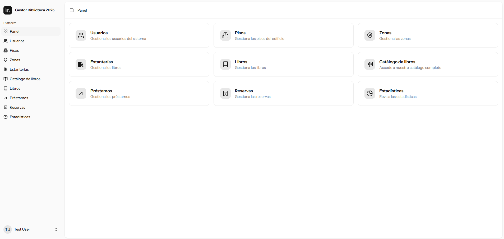

<div align="center">

# 📚 Gestor de Biblioteca

Este proyecto es un gestor de biblioteca completo diseñado para optimizar la administración del catálogo y el control de los libros. Permite a los usuarios gestionar libros, estanterías, zonas y pisos, así como llevar un control del estado de disponibilidad, préstamos y reservas de ejemplares.

La aplicación sigue una arquitectura modelo-vista-controlador, utilizando **Laravel** para el backend (PHP) y **React** para el frontend (TypeScript).

</div>

---

## ✨ Características principales

- 📚 **Gestión completa** de libros, estanterías, zonas y pisos (CRUD).
- 🔄 **Control de disponibilidad**: visualización clara del estado (disponible o reservado).
- 📬 **Notificaciones por email** para usuarios.
- 📊 **Gráficos estadísticos** para análisis del uso.
- 📜 **Línea de tiempo** de actividad de cada usuario.
- 📷 **Lectura y creación de códigos QR** para libros.
- 🔍 **Búsqueda y filtrado** por múltiples criterios.
- 🎨 **Interfaz moderna e intuitiva** desarrollada con React.
- 🔌 **API RESTful** con Laravel para comunicación eficiente y escalable.

---

## 🛠️ Tecnologías utilizadas

- **Backend**: Laravel + PHP 8
- **Frontend**: React + TypeScript + Tailwind CSS
- **Comunicación**: Inertia.js
- **Formularios**: TanStack Form
- **Base de datos**: PostgreSQL
- **Entorno de desarrollo**: Docker + Docker Compose
- **Panel de BD**: PgAdmin

---

## 🚀 Cómo iniciar el proyecto (Ubuntu + Docker)

### 🐳 Pasos para levantar el entorno

1. Clona el repositorio:
   ```bash
   git clone https://github.com/anacampos23/biblioteca_2025
   cd biblioteca_2025


2. Copia el archivo .env.example y renómbralo a .env:
    ```bash
    cp .env.example .env
    ```

3. Levanta los contenedores con Docker:
    ```bash
    docker-compose up -d --build
    ```

4. Instala las dependencias de Laravel y del frontend:
    ```bash
    docker exec app composer install
    docker exec app npm install
    ```

5. Aplica las migraciones:
    ```bash
    docker exec app php artisan migrate:fresh --seed
    ```

## 🔐 Acceso por defecto
Laravel:

Email: admin@biblioteca.com

Contraseña: password

## 📸 Capturas de Pantalla



## 🧑‍💻 Autor
Desarrollado por Ana Campos Aguilar


